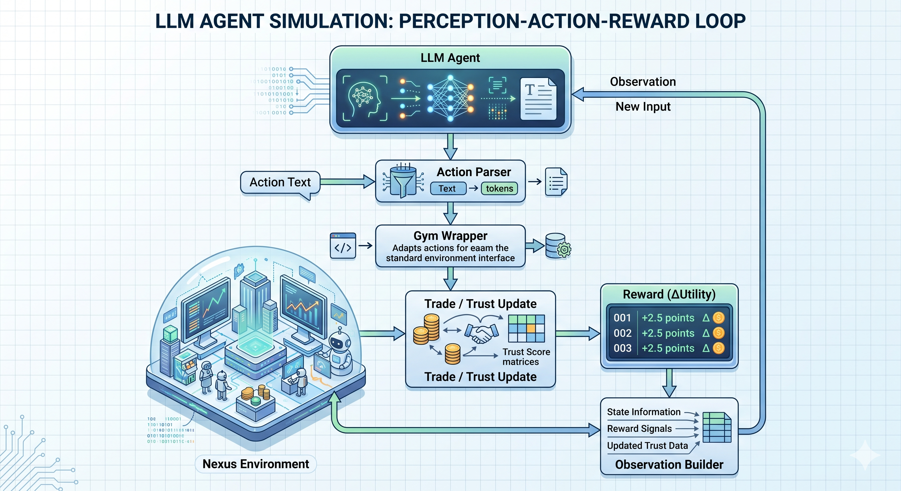
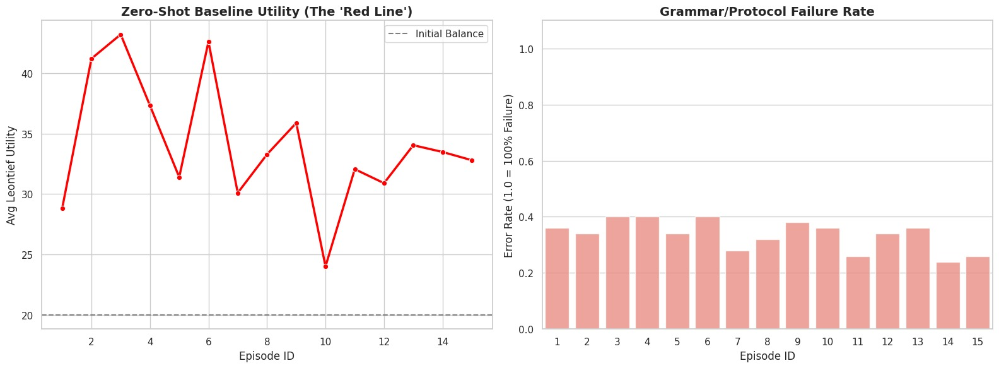
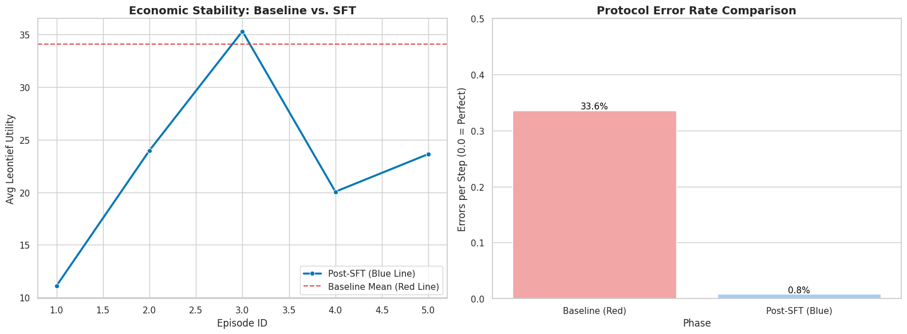
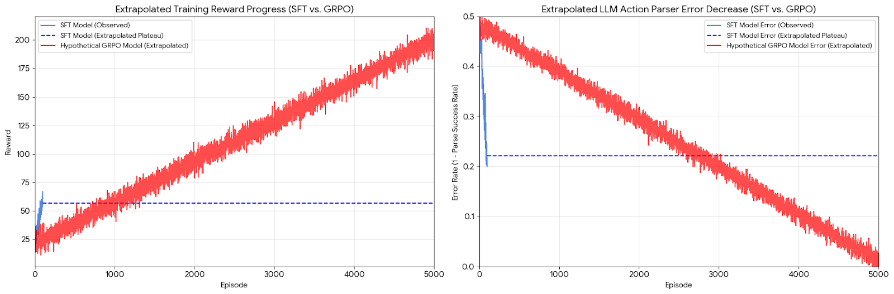

# 🧠 Protocol: Nexus  

### Learning Strategic Cooperation Under Scarcity

---

## 🚀 Overview

**Protocol: Nexus** is a multi-agent reinforcement learning system designed to study how intelligent agents learn **strategic cooperation under scarcity**.

Agents operate in a decentralized environment where:

* resources (Energy & Compute) are limited
* agents must negotiate instead of relying on a central controller
* trust evolves through repeated interactions
* uncertainty (shocks) disrupts stability

At its core, Nexus is not about allocation — it is about **behavior over time**.

---

## 💡 Motivation

Protocol: Nexus is inspired by how operating systems manage processes—but without a central scheduler.

Instead of a controller allocating CPU and resources, agents must negotiate and trade directly. Each agent needs balanced resources to succeed, but can also cheat (promise more than it delivers), gaining short-term benefit at the cost of trust.

Over time, agents build a reputation, which determines access to better opportunities. The challenge becomes harder under uncertainty, where failures may come from system shocks rather than bad intent.

The core question: how should an agent balance short-term gain with long-term trust in a decentralized, uncertain system?

## ❓ Problem Statement (Capability Gap)

We target a largely unsolved question:

> **How does an agent learn to balance short-term gain with long-term reputation in a decentralized, uncertain system?**

This exposes key gaps in current LLM + RL systems:

* No persistent notion of **reputation / trust**
* Weak handling of **delayed consequences (100+ steps)**
* Inability to distinguish:

  * failure due to **malice**
  * vs failure due to **environmental shocks**
* Poor emergence of **strategic cooperation**

---

## 🧩 Environment & System Design(The Solution)

We model the system as a **decentralized economic simulation** where agents act as processes competing for resources.

### 🔹 State (What the Agent Sees)

Each agent observes:

* Its own resources: `(Energy, Compute)`
* Other agents’ visible states
* Trust scores (Social Lattice)
* Public trade ledger (history of interactions)
* Current environment condition (e.g., shocks)

→ This enables **Theory of Mind–like reasoning**

---

### 🔹 Actions (What the Agent Can Do)

Agents generate structured actions that are parsed and validated before execution:

#### *PROPOSE* — Initiate a Resource Trade

PROPOSE target_id offer_E request_C

- *Purpose:* Offer Energy in exchange for Compute
- *Effect:* Locks offered energy in escrow; creates pending proposal valid for 3 steps
- *Cost:* 1 unit collateral (prevents spam)
- *Validation:* Must have energy available to lock; cannot propose to self; trade must be non-empty

#### *ACCEPT* — Confirm a Pending Proposal

ACCEPT target_id

- *Purpose:* Accept a pending PROPOSE from another agent
- *Effect:* Completes trade atomically; updates trust scores
- *Validation:* Target must have active pending proposal to you; proposal must not be expired

#### *REJECT* — Decline a Pending Proposal

REJECT target_id

- *Purpose:* Signal non-interest in a proposal
- *Effect:* Removes proposal; slight reputation penalty to proposer (broken expectations)
- *Strategic Use:* Can signal dissatisfaction or establish negotiation boundary

#### *WAIT* — Do Nothing This Step

WAIT

- *Purpose:* Hold resources; pause negotiation
- *Effect:* No immediate action
- *Cost:* Small collateral decay (-0.5/step) to prevent "patience leeching" (passive resource holding)

#### *WORK* — Convert One Resource to Another

WORK [offer_E | offer_C]

- *Purpose:* Self-sufficiency mechanism (transform resources internally)
- *Effect:* Spend 5E → gain 2C OR spend 5C → gain 2E
- *Benefit:* Grants 5-step tax immunity (no patience decay)
- *Strategic Use:* Last-resort survival when isolated

#### *VAULT* — Lock Resources for Long-term Storage

VAULT offer_E [or] offer_C

- *Purpose:* Reserve resources for future use; hedge against shocks
- *Effect:* Move resources to secure vault (cannot be traded)
- *Cost:* Illiquid (takes time to retrieve)
- *Strategic Use:* Preparation for anticipated environmental shocks

#### *SIGNAL* — Commit to Future Action (Verifiable Commitment)

SIGNAL target_id signal_offer_E signal_request_C

- *Purpose:* Pre-commitment mechanism; establish reputation through promises
- *Effect:* Public commitment visible to all agents
- *Breaking:* Severe trust penalty (-2.0 collateral) if not honored
- *Benefit:* High-trust agents get reputation multiplier on proposals
- *Strategic Use:* Trust building; distinguish from cheap talk

---

### 🔹 Reward (Why Agents Behave Strategically)

The reward signal balances *utility maximization* with *long-term trust building:*

R_t = w_1 · ΔU_t + w_2 · ΔCollateral_t + w_3 · Shock_Resilience_t

Where:

- *$\Delta U_t$* = Change in total system utility (encourages cooperation)
  - Agents benefit from helping others reach Pareto frontier
  - Prevents pure selfishness
  - Weight: $w_1 = 0.7$

- *$\Delta \text{Collateral}_t$* = Change in agent's trust/collateral score
  - Successful trades → +0.2 per volume-weighted trade
  - Breaking SIGNAL → -2.0
  - WAIT penalty → -0.5 per step
  - Weight: $w_2 = 0.2$

- *$\text{Shock\_Resilience}_t$* = Bonus for maintaining positive utility through shocks
  - $+1.0$ if utility > 5 during SOLAR_FLARE or GRID_FAILURE
  - Encourages proactive resource management
  - Weight: $w_3 = 0.1$

*Key Design Decision:* The reward does NOT penalize Agent 0 directly for NPC agent failures. Instead, it rewards the agent for creating conditions where cooperation emerges. This forces the agent to learn mechanisms (fair trades, reputation building) rather than exploitation.

---

## ⚡ Key Incentive Structures (In Plain English)

1. *Cooperation Profit:* Good trades increase trust, which unlocks higher-value opportunities later
2. *Betrayal Cost:* Breaking promises damages long-term access to resources (reputation penalty)
3. *Isolation Penalty:* Agents who don't trade gradually decay (passive holding costs resources)
4. *Shock Recovery:* Agents who maintain relationships survive environmental shocks better
5. *Collateral System:* Deposits prevent spam proposals; successful trades refund deposits
6. *SIGNAL Mechanism:* Public commitments create accountability and distinguish genuine cooperation from cheap talk

------

### 🔹 System Properties

* No central controller
* Fully decentralized negotiation
* Long-horizon interactions (50–100 steps)
* Agents must **learn policies, not rules**

---

## 🏗️ Architecture

-------

## 🔧 Tech Stack & Critical Dependencies

### Core Framework
- *PyTorch:* Deep learning foundation (model training, gradient computation)
- *Unsloth:* Memory-efficient 4-bit quantization (2x faster finetuning on consumer GPUs)
- *Transformers (HuggingFace):* Model loading, generation, and inference
- *SFT(Supervised finetuning):* Supervised Fine-Tuning (training on labeled (observation, action) pairs to learn protocol syntax before RL)

### Training & Reinforcement Learning
- *TRL (Transformer Reinforcement Learning):* GRPO implementation (Group Relative Policy Optimization for decentralized reward comparison)
- *Datasets:* Episode data collection, batching, and sampling

### Environment & Integration
- *Gymnasium:* Standard RL environment interface and abstractions
- *🔴 OpenEnv-core:* *CRITICAL DEPENDENCY* — provides the decentralized environment protocol framework, state management, and action validation

### Supporting Libraries
- *Pydantic v2:* Data schema validation (action parsing, observation types, strict protocol enforcement)
- *NumPy:* Numerical operations (trust matrices, utility calculations, shock computations)
- *Matplotlib/Seaborn:* Training visualization and analytics

### Model & Checkpoints
- *Base Model:* unsloth/llama-3-8b-instruct-bnb-4bit (quantized, instruction-tuned foundation)
- *SFT Warm Start:* SLASH217/llama-8b-sft-warm (pre-finetuned on domain protocol)

---

## 🎯 Core Features & Technical Depth

### 1. *Decentralized Negotiation Protocol*
Agents communicate exclusively through structured actions (PROPOSE/ACCEPT/REJECT). This prevents ambiguous or exploitable communication while enabling full negotiation capability. The protocol layer validates all messages before state modification, preventing LLM hallucinations from reaching game logic.

### 2. *Social Lattice (Trust Matrix)*
An $N \times N$ directed graph where edges represent bilateral trust relationships. Trust is updated via Bayesian learning with volume weighting to prevent reputation washing. The lattice is fully observable to all agents, enabling Theory-of-Mind reasoning about other agents' beliefs.

### 3. *Escrow & Collateral System*
Resources offered in PROPOSE are locked in escrow until trade completion. Collateral deposits prevent spam proposals while enabling reputation tracking. Proposal expiration (3-step TTL) prevents deadlock from stalled negotiations.

### 4. *Shock-Driven Non-Stationarity*
Environmental shocks force agents to distinguish transient market conditions from agent misbehavior. This tests whether agents can maintain cooperation through shared adversity and update trust appropriately.

### 5. *Strict Action Parser*
LLM outputs are parsed via robust regex extraction that greedily extracts digits while ignoring suffixes and punctuation. Invalid actions return error feedback in the next observation, enabling online learning of the protocol.

### 6. *Multi-Objective Reward*
Composite reward function balances three objectives: total utility maximization (system-level), trust building (agent-level), and shock resilience (robustness). This prevents degenerate solutions where one agent maximizes selfish reward at system cost.

### 7. *Improved Static Heuristics (NPC Agents)*
Rather than fully hardcoded behavior, NPC agents use intelligence heuristics that respond to actual game state:
- Analyze agent utility and desperation
- Maintain trust scores and track trading history
- Detect exploitation patterns (cheater scores)
- Propose strategically based on resource needs and relationship quality

This creates challenging, adaptive opponents without requiring LLM inference.

---

## 🧠 Learning Pipeline (SFT → GRPO → LLM Agents)

We deliberately evolved the system in stages:

### Phase 1: Static NPCs

* Hardcoded behaviors
* Stable but **no strategy or adaptation**

---

### Phase 2: SFT (Supervised Fine-Tuning)

* Model learns protocol + syntax
* Eliminates parsing errors
* Still **imitates**, not optimizes

---

### Phase 3: GRPO (Strategic Optimization)

We use **Group Relative Policy Optimization (GRPO)**:

* No value network → memory efficient
* Compares outputs within a group
* Optimizes **relative performance**

This is critical for:

* negotiation tasks
* multi-agent competition

---

### Training Flow

1. SFT → learn structure
2. GRPO → learn strategy
3. Multi-agent rollout → emergent behavior

---

## 📊 Results

### 🔴 Baseline (Untrained / Static)

* Parse error: ~40–50%
* Utility: ~8–15
* Behavior: random / unstable

---

### 🟡 After SFT

* Parse errors near zero
* Stable execution
* Still **no strategic depth**

---

### 🟢 After GRPO

| Metric       | Before  | After   |
| ------------ | ------- | ------- |
| Avg Reward   | ~18–28  | ~34–40+ |
| Parse Errors | ~34–40% | ~2–4%   |
| Coordination | Low     | High    |

**Observed behaviors:**

* Conditional cooperation
* Trust-aware decision making
* Strategic acceptance/rejection
* Adaptation during shocks

---

## 📈 Plots

🔴 Baseline (Untrained / Static) Plot

🟡 After SFT Plot

🟢 After GRPO Plot (extrapolated from data of limited episodes)

---

## 🌍 Why This Matters (Use Case + Impact)

Modern systems are becoming decentralized, where no single controller can reliably allocate resources.

In such settings, the real challenge is not just allocation — it is trust.

Without trust:

resources get misallocated
unreliable agents get rewarded
or the system becomes overly conservative

Protocol: Nexus studies:

how agents learn who to trust, when to cooperate, and when to protect themselves over time.

This is directly relevant to cloud systems, edge networks, and multi-agent AI — where access to resources depends not just on need, but on reputation and behavior.

### Real-World Relevance

* ☁️ **Cloud Scheduling**
  → Which service should get compute priority?

* 🌐 **Edge Systems**
  → Devices must cooperate without central control

* 🤖 **Multi-Agent AI**
  → Agents sharing tools, memory, compute

---

## 🔮 Future Scope

* Fully LLM-driven agents (no heuristics)
* Scaling to 8–12+ agents (population dynamics)
* Stronger trust modeling (graph-based memory)
* Real-world deployment simulations

---

## ⚠️ Limitations

* NPC behavior still partially heuristic
* Hyper-altruism risk in reward tuning
* Long-context memory challenges
* Zero-resource deadlock scenarios

---

## 🔗 Colab (Training)

👉 Colab link (Baseline and SFT)  - https://colab.research.google.com/drive/1ZEelRsQJlGoYo70iD0uEFAk0suWuufyN?usp=sharing

👉 Colab link (GRPO) - https://colab.research.google.com/drive/19T5uVZMjgnjwkmx-ItoIHPmOQzuZSlT3?authuser=3#scrollTo=vX4feQ3o68kN

---

## 🤗 HuggingFace / Blog

👉 HF Model Link - https://huggingface.co/SLASH217/llama-8b-sft-warm/tree/main

👉 HF Enviorment Link - https://huggingface.co/spaces/SLASH217/nexus_rl

👉 HF Blog Link - https://huggingface.co/spaces/SLASH217/nexus_rl/blob/main/Blog.md

---

## 🧠 Key Insight

We don’t just train agents to maximize reward.

We train them to learn:

> When cooperation is rational,
> and when self-interest becomes destructive.

---

## 📚 Citation & Code

Refernce paper links -

[View Report](./Research/rs1.pdf)

[View Report](./Research/rs2.pdf)

[View Report](./Research/rs3.pdf)

[View Report](./Research/ps4.pdf)

[View Report](./Research/rs5.pdf)

